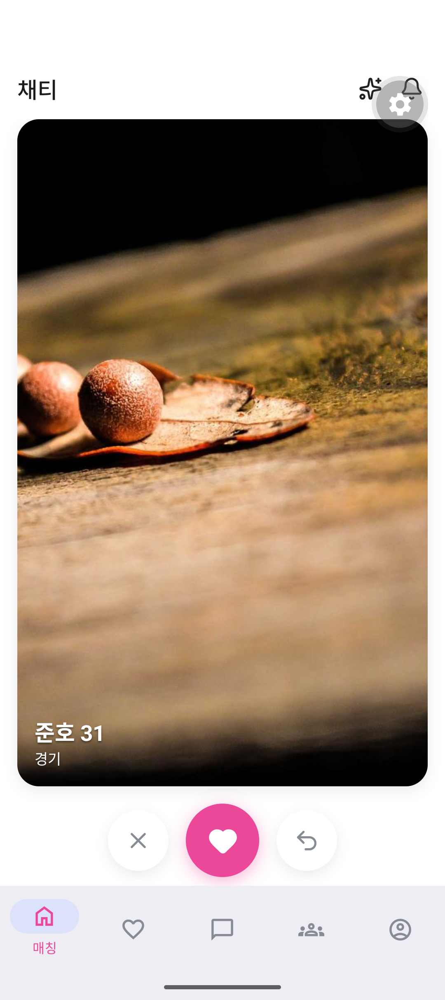
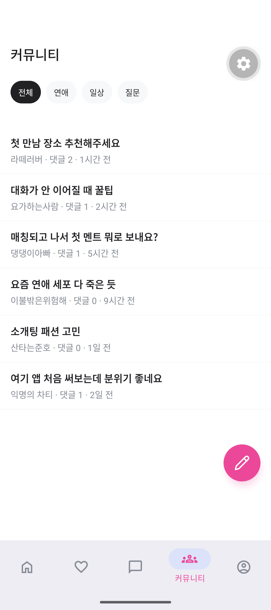
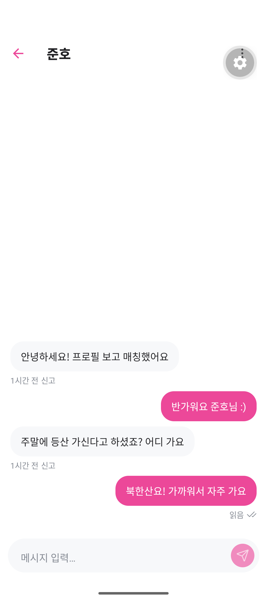
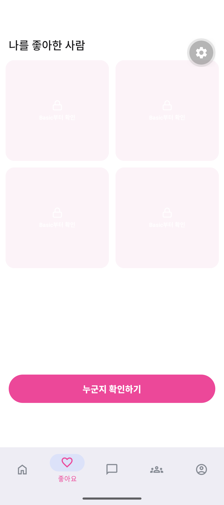
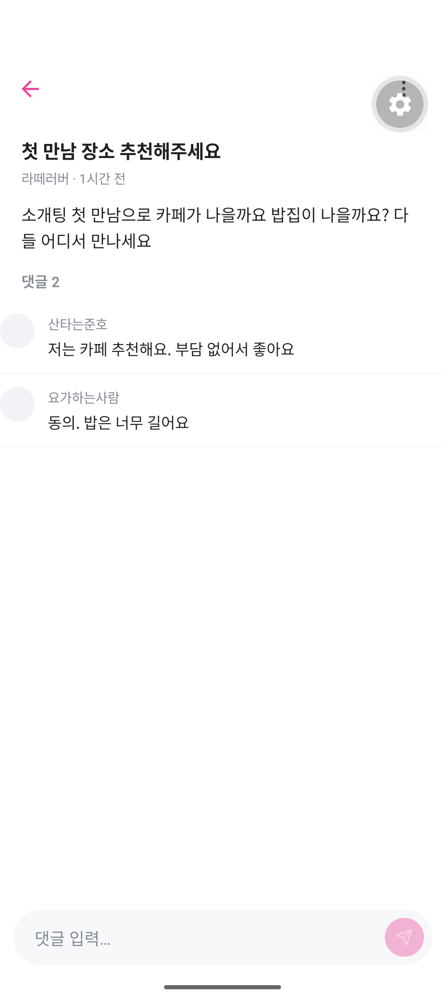
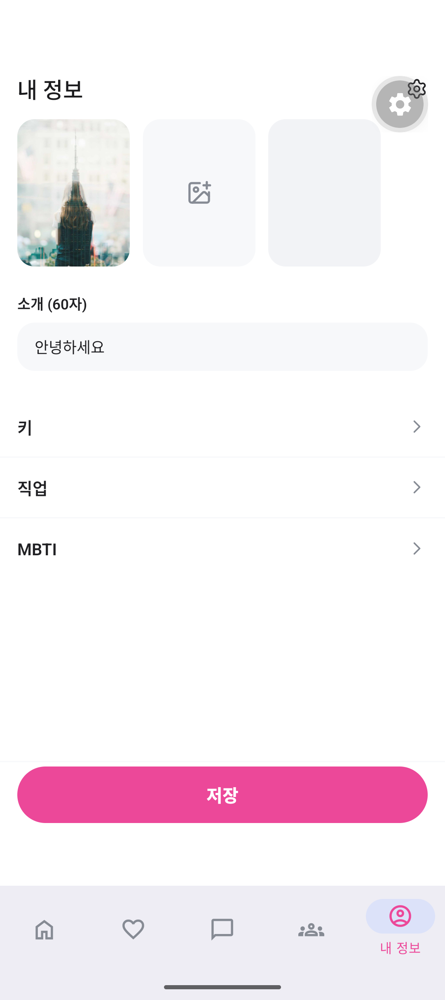

# ChatTea

소개팅/매칭 모바일 앱 + 익명 커뮤니티 서비스. iOS/Android 네이티브 앱과 GraphQL 백엔드를 git submodule 워크스페이스로 묶어 개발한다.

## 스크린샷

| 매칭 | 커뮤니티 | 채팅 |
| --- | --- | --- |
|  |  |  |

| 좋아요 | 게시글 | 프로필 |
| --- | --- | --- |
|  |  |  |

## 레포지토리

| 경로 | 레포 | 설명 |
|------|------|------|
| `chattea-fe` | [ChatTeaDot/chattea-fe](https://github.com/ChatTeaDot/chattea-fe) | Expo React Native 앱 + 커뮤니티 WebView용 Vite React 앱 |
| `chattea-be` | [ChatTeaDot/chattea-be](https://github.com/ChatTeaDot/chattea-be) | NestJS GraphQL API + PostgreSQL |

## 기술 스택

- **모바일**: Expo 56, React Native, Expo Router, React Native Unistyles, Apollo Client, Storybook(온디바이스)
- **웹**: Vite, React, Fastify SSR(스트리밍), TanStack Query, vanilla-extract
- **백엔드**: NestJS 11, GraphQL, Drizzle ORM, PostgreSQL 17, Passport/JWT
- **연동**: Kakao OAuth, RevenueCat 구독/인앱결제, Expo Push, Cloudflare R2, Sentry, Datadog

## 주요 기능

- 오늘의 매칭 — 카드 스와이프 기반 일일 추천, 관심 보내기/되돌리기
- 좋아요 — 나를 좋아한 사람 그리드, 구독 등급별 블러 잠금
- 채팅 — 매칭 성사 후 실시간 대화방, 읽음 표시
- 커뮤니티 — 익명 게시판(카테고리, 댓글), 앱 내 WebView로 임베드
- 프로필 — 사진 그리드 편집, 서버 검증 업로드 파이프라인
- 구독 결제 — RevenueCat 기반 Basic/Black 등급

## 아키텍처 하이라이트

- **디자인 시스템**: 당근 SEED를 참고한 3계층 토큰(`scale → semantic → component`)과 Unistyles 기반 라이트/다크 테마, 온디바이스 Storybook으로 컴포넌트 문서화
- **WebView SSR**: 커뮤니티는 별도 Vite 앱을 Fastify가 `renderToPipeableStream`으로 스트리밍 SSR해 네이티브 탭 안에 WebView로 렌더
- **보안**: 프로필 사진은 presigned PUT → 서버 재검증/재인코딩 4단계 파이프라인, RevenueCat 웹훅은 HMAC-SHA256 서명 검증 + 멱등 처리
- **프로덕션 안전장치**: 백엔드는 필수 설정 없으면 기동을 거부하는 fail-closed 구성, non-transactional 마이그레이션 러너, advisory lock 기반 maintenance 워커
- **CI**: 워크스페이스 루트에서 backend / frontend / operations 게이트를 매 푸시마다 실행
